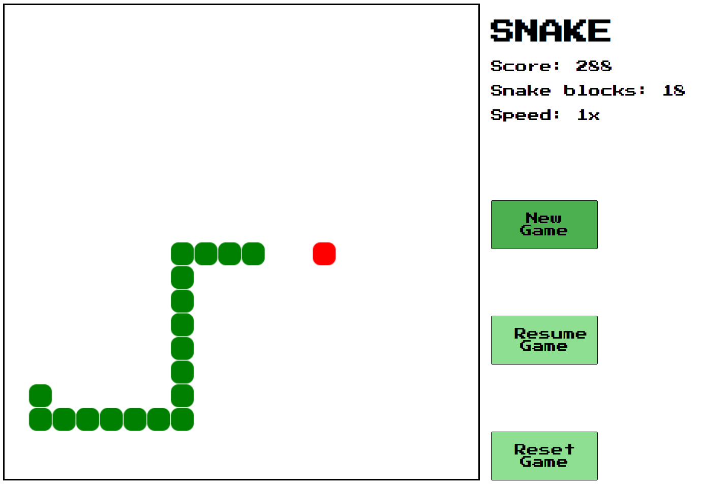

# SnakeNG - snake game in angular
My very first app was snake game in Java. I created this project to practice my Angular skills and for fun, my goal was port it from Java to TypeScript

## Features

- Single player snake game
- Keyboard control 

## Development server

Run `npm run start:dev` for a dev server. Navigate to `http://localhost:4200/`. The app will automatically reload if you change any of the source files.

## Build

Run `npm run build` to build the project. The build artifacts will be stored in the `dist/` directory. This generates a production build.

## Docker image

Run `docker image build -t snake-ng:1.0 .` to build docker image.\
Run `docker container run -d -p 80:80 --name snake-ng snake-ng:1.0` to run nginx server including snake from docker image.\
Go to [http://localhost](http://localhost) in your browser to play snake on your local machine

